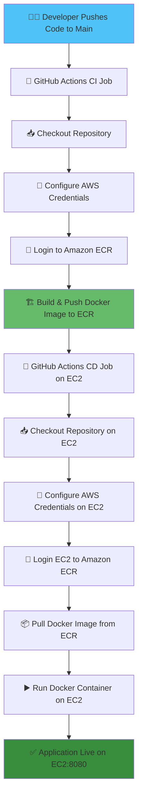
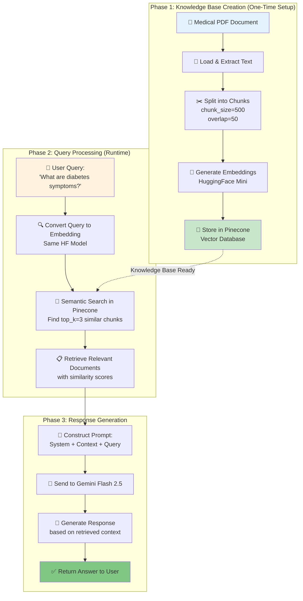

# 🏥 MediBot – AI-Powered Healthcare Chatbot


## 🎯 Overview

MediBot uses **Retrieval-Augmented Generation (RAG)** to provide accurate, contextual medical information by combining the power of vector search with large language models. This approach ensures responses are grounded in your medical dataset rather than relying solely on the LLM's training data.

# 📚 RAG (Retrieval-Augmented Generation) Documentation
---
## 🧠 What is RAG?

**Retrieval-Augmented Generation** is a technique that enhances LLM responses by:

1. **Retrieving** relevant information from a knowledge base
2. **Augmenting** the user's query with retrieved context
3. **Generating** responses based on both the query and retrieved information

### Why RAG for Healthcare?

- ✅ **Accuracy**: Responses grounded in verified medical documents
- ✅ **Up-to-date**: Easy to update knowledge base without retraining models
- ✅ **Transparency**: Can trace answers back to source documents
- ✅ **Cost-effective**: No need for expensive fine-tuning
- ✅ **Domain-specific**: Tailored to your medical dataset

---

## 🏗️ RAG Architecture in MediBot

```
┌─────────────────────────────────────────────────────────────┐
│                    MEDIBOT RAG PIPELINE                      │
└─────────────────────────────────────────────────────────────┘

┌──────────────────┐         ┌──────────────────┐
│  Medical PDF     │────────▶│  Text Extraction │
│  (source.pdf)    │         │  & Chunking      │
└──────────────────┘         └──────────────────┘
                                      │
                                      ▼
                             ┌──────────────────┐
                             │ HuggingFace      │
                             │ sentence-        │
                             │ transformers     │
                             │ (Mini)           │
                             └──────────────────┘
                                      │
                                      ▼ (Embeddings)
                             ┌──────────────────┐
                             │   Pinecone       │
                             │ Vector Database  │
                             │ (Knowledge Base) │
                             └──────────────────┘

═══════════════════════════════════════════════════════════════

                        QUERY TIME

┌──────────────────┐
│  User Query:     │
│ "What causes     │
│  diabetes?"      │
└──────────────────┘
         │
         ▼
┌──────────────────┐
│ Query Embedding  │
│ (same model)     │
└──────────────────┘
         │
         ▼
┌──────────────────┐
│ Similarity Search│
│ in Pinecone      │
│ (top_k=3)        │
└──────────────────┘
         │
         ▼
┌──────────────────┐
│ Retrieved Docs:  │
│ 1. Context 1     │
│ 2. Context 2     │
│ 3. Context 3     │
└──────────────────┘
         │
         ▼
┌──────────────────────────────────┐
│  Prompt Construction:            │
│  ┌────────────────────────────┐  │
│  │ System: You are a medical  │  │
│  │ assistant...               │  │
│  │                            │  │
│  │ Context: [Retrieved Docs]  │  │
│  │                            │  │
│  │ Question: What causes      │  │
│  │ diabetes?                  │  │
│  └────────────────────────────┘  │
└──────────────────────────────────┘
         │
         ▼
┌──────────────────┐
│ Gemini Flash 2.5 │
│ (LLM Generation) │
└──────────────────┘
         │
         ▼
┌──────────────────┐
│ Final Response   │
│ to User          │
└──────────────────┘
```

---

## 📋 Table of Contents

- [Features](#-features)
- [Tech Stack](#️-tech-stack)
- [Architecture](#-architecture)
- [Local Development Setup](#️-local-development-setup)
- [AWS CI/CD Deployment](#-aws-cicd-deployment)
- [Workflow Diagram](#-cicd-workflow-diagram)
- [Environment Variables](#-environment-variables)
- [Contributing](#-contributing)
- [License](#-license)

## ✨ Features

- 🤖 **AI-Powered Responses** - Leverages GPT for intelligent medical query responses
- 🔍 **Vector Search** - Uses Pinecone for efficient semantic search
- 🚀 **Auto-Deployment** - GitHub Actions CI/CD pipeline to AWS
- 🐳 **Dockerized** - Containerized application for consistent deployments
- ☁️ **Cloud-Ready** - Deployed on AWS EC2 with ECR integration
- 🔒 **Secure** - Environment-based configuration with secrets management

## 🛠️ Tech Stack

| Technology | Purpose |
|------------|---------|
| **Python 3.10** | Core programming language |
| **LangChain** | LLM framework for AI workflows |
| **Flask** | Web application framework |
| **OpenAI GPT** | Language model for responses |
| **Pinecone** | Vector database for embeddings |
| **Docker** | Containerization |
| **AWS ECR** | Docker image registry |
| **AWS EC2** | Application hosting |
| **GitHub Actions** | CI/CD automation |

## 🏗 Architecture

```
┌─────────────┐      ┌──────────────┐      ┌─────────────┐
│   User      │─────▶│  Flask Web   │─────▶│  LangChain  │
│  Interface  │      │     App      │      │   Agent     │
└─────────────┘      └──────────────┘      └─────────────┘
                            │                      │
                            │                      ▼
                            │              ┌─────────────┐
                            │              │   OpenAI    │
                            │              │     GPT     │
                            │              └─────────────┘
                            │                      │
                            ▼                      ▼
                     ┌──────────────┐      ┌─────────────┐
                     │   Pinecone   │◀─────│  Embeddings │
                     │    Vector    │      │   Storage   │
                     │   Database   │      └─────────────┘
                     └──────────────┘
```

## ⚙️ Local Development Setup

### **Prerequisites**

- Python 3.10+
- Conda (Anaconda/Miniconda)
- Pinecone Account
- Google Cloud Account (for Gemini API)

### **Step 1 – Create Conda Environment**

```bash
conda create -n medibot python=3.10 -y
conda activate medibot
```

### **Step 2 – Install Dependencies**

```bash
pip install -r requirements.txt
```

### **Step 3 – Configure Environment Variables**

Create a `.env` file in the project root:

```env
PINECONE_API_KEY=your_pinecone_api_key_here
GOOGLE_APPLICATION_CREDENTIALS=path/to/gemini_key.json
```

### **Step 4 – Store Embeddings in Pinecone**

```bash
python store_index.py
```

This script processes medical data and stores vector embeddings in Pinecone.

### **Step 5 – Run Application**

```bash
python app.py
```

Navigate to: **http://localhost:8080**

## 🚀 AWS CI/CD Deployment

Our deployment pipeline uses **GitHub Actions** to automate the entire deployment process from code push to production.

### **Deployment Flow**

1. **Code Push** → Triggers GitHub Actions workflow
2. **CI Job** (GitHub-hosted runner)
   - Checkout code
   - Configure AWS credentials
   - Build Docker image
   - Push to AWS ECR
3. **CD Job** (EC2 self-hosted runner)
   - Pull latest image from ECR
   - Stop old container
   - Run new container with environment variables

### **AWS Infrastructure Setup**

#### 1️⃣ **IAM User Configuration**

Create an IAM user with the following policies:
- `AmazonEC2FullAccess`
- `AmazonEC2ContainerRegistryFullAccess`

#### 2️⃣ **AWS ECR Repository**

Use AWS Consoel for the same.
Example ECR URI: `777014042666.dkr.ecr.ap-south-1.amazonaws.com/medi-bot`

#### 3️⃣ **EC2 Instance Setup**

Launch an Ubuntu EC2 instance and install Docker:

```bash
# Install Docker
curl -fsSL https://get.docker.com -o get-docker.sh
sudo sh get-docker.sh
sudo usermod -aG docker ubuntu
newgrp docker
```

#### 4️⃣ **Configure Self-Hosted Runner**

1. Go to **Repository Settings** → **Actions** → **Runners** → **New self-hosted runner**
2. Follow the setup instructions on your EC2 instance
3. Start the runner service

#### 5️⃣ **GitHub Secrets Configuration**

Add the following secrets in **Settings** → **Secrets and variables** → **Actions**:

| Secret Name | Description |
|-------------|-------------|
| `AWS_ACCESS_KEY_ID` | AWS IAM access key |
| `AWS_SECRET_ACCESS_KEY` | AWS IAM secret key |
| `AWS_DEFAULT_REGION` | AWS region (e.g., ap-south-1) |
| `ECR_REPO` | ECR repository name (e.g., medi-bot) |
| `PINECONE_API_KEY` | Pinecone API key |

## 📊 CI/CD Workflow Diagram



## 📁 Project Structure

```
medibot/
├── .github/
│   └── workflows/
│       └── cicd.yml          # CI/CD workflow configuration
├── app.py                    # Flask application
├── data/
│   └── source.pdf             # Dataset
├── src/
│   └── __init__.py
│	└── helper.py               # Helper functions
│	└── prompt.py               # Coniguration of system prompt
├── store_index.py              # Script to store embeddings
├── requirements.txt            # Python dependencies
├── Dockerfile                  # Docker configuration
├── .env                        # Environment variables (not committed)
├── gemini_key.json            # Google Cloud credentials (not committed)
└── README.md                   # Project documentation
```

## 🔒 Environment Variables

| Variable | Description | Required |
|----------|-------------|----------|
| `PINECONE_API_KEY` | API key for Pinecone vector database | ✅ |
| `GOOGLE_APPLICATION_CREDENTIALS` | Path to Google Cloud service account JSON | ✅ |
| `AWS_ACCESS_KEY_ID` | AWS IAM access key (deployment only) | ✅ |
| `AWS_SECRET_ACCESS_KEY` | AWS IAM secret key (deployment only) | ✅ |
| `AWS_DEFAULT_REGION` | AWS region (deployment only) | ✅ |

## 📜 GitHub Actions Workflow

The complete workflow is defined in `.github/workflows/deploy.yml`:

```yaml
name: Deploy Application Docker Image to EC2 instance

on:
  push:
    branches: [main]

jobs:
  Continuous-Integration:
    runs-on: ubuntu-latest
    steps:
      - name: Checkout
        uses: actions/checkout@v2

      - name: Configure AWS credentials
        uses: aws-actions/configure-aws-credentials@v1
        with:
          aws-access-key-id: ${{ secrets.AWS_ACCESS_KEY_ID }}
          aws-secret-access-key: ${{ secrets.AWS_SECRET_ACCESS_KEY }}
          aws-region: ${{ secrets.AWS_DEFAULT_REGION }}

      - name: Login to Amazon ECR
        id: login-ecr
        uses: aws-actions/amazon-ecr-login@v1

      - name: Build, tag, and push image to Amazon ECR
        id: build-image
        env:
          ECR_REGISTRY: ${{ steps.login-ecr.outputs.registry }}
          ECR_REPOSITORY: ${{ secrets.ECR_REPO }}
          IMAGE_TAG: latest
        run: |
          docker build -t $ECR_REGISTRY/$ECR_REPOSITORY:$IMAGE_TAG .
          docker push $ECR_REGISTRY/$ECR_REPOSITORY:$IMAGE_TAG

  Continuous-Deployment:
    needs: Continuous-Integration
    runs-on: self-hosted
    steps:
      - name: Checkout
        uses: actions/checkout@v3

      - name: Configure AWS credentials
        uses: aws-actions/configure-aws-credentials@v1
        with:
          aws-access-key-id: ${{ secrets.AWS_ACCESS_KEY_ID }}
          aws-secret-access-key: ${{ secrets.AWS_SECRET_ACCESS_KEY }}
          aws-region: ${{ secrets.AWS_DEFAULT_REGION }}

      - name: Login to Amazon ECR
        id: login-ecr
        uses: aws-actions/amazon-ecr-login@v1

      - name: Run Docker Image on EC2
        run: |
          docker run -d \
            -v /home/ubuntu/secrets/gemini_key.json:/app/gemini_key.json \
            -e AWS_ACCESS_KEY_ID="${{ secrets.AWS_ACCESS_KEY_ID }}" \
            -e AWS_SECRET_ACCESS_KEY="${{ secrets.AWS_SECRET_ACCESS_KEY }}" \
            -e AWS_DEFAULT_REGION="${{ secrets.AWS_DEFAULT_REGION }}" \
            -e PINECONE_API_KEY="${{ secrets.PINECONE_API_KEY }}" \
            -e GOOGLE_APPLICATION_CREDENTIALS="/app/gemini_key.json" \
            -p 8080:8080 \
            "${{ steps.login-ecr.outputs.registry }}"/"${{ secrets.ECR_REPO }}":latest
```

## 📊 Complete RAG Workflow



---

## 🔧 Technical Components

### 1️⃣ **Embedding Model**

**Model**: `sentence-transformers/all-MiniLM-L6-v2`

```python
from langchain.embeddings import HuggingFaceEmbeddings

def embedding_model():
    model_name='sentence-transformers/all-MiniLM-L6-v2'
    embeddings=HuggingFaceEmbeddings(
        model_name=model_name
    )
    return embeddings

embed_model=embedding_model()
```

**Specifications**:
- **Dimensions**: 384
- **Max Sequence Length**: 256 tokens
- **Performance**: Fast inference, suitable for production
- **Use Case**: Semantic similarity search

### 2️⃣ **Vector Database**

**Platform**: Pinecone

```python
from pinecone import Pinecone
from pinecone import ServerlessSpec

pincone_key=PINECONE_API_KEY
pc=Pinecone(api_key=pincone_key)


# Create vector store
indexName='medical-chatbot'

if not pc.has_index(indexName):
    pc.create_index(
        name=indexName,
        dimension=384,
        metric='cosine',
        spec=ServerlessSpec(cloud='aws',region='us-east-1')
    )
    
index=pc.Index(indexName)
```

**Configuration**:
- **Index Name**: `medical-chatbot`
- **Dimension**: 384 (matches embedding model)
- **Metric**: Cosine similarity
- **Pods**: Starter (scalable)

### 3️⃣ **Language Model**

**Model**: Google Gemini Flash 2.5

```python
rom langchain_google_genai import ChatGoogleGenerativeAI

llm = ChatGoogleGenerativeAI(model="gemini-2.5-flash")
```

**Why Gemini Flash 2.5?**
- ⚡ Fast inference (optimized for speed)
- 💰 Cost-effective
- 🎯 Good at following instructions
- 📝 Excellent for Q&A tasks

---

## 🔄 Detailed Process Flow

### **Phase 1: Building the Knowledge Base**

#### Step 1: Document Loading
```python
from langchain.document_loaders import DirectoryLoader, PyPDFLoader

def load_pdf(data):
    loader=DirectoryLoader(
        data,
        glob='*.pdf',
        loader_cls=PyPDFLoader
    )
    
    documents=loader.load()
    return documents
text=load_pdf("../data")
```

#### Step 2: Text Chunking
```python
from langchain.text_splitter import RecursiveCharacterTextSplitter

def chunking(docs):
    text_splitter=RecursiveCharacterTextSplitter(
        chunk_size=500,
        chunk_overlap=20
    )
    chunks=text_splitter.split_documents(docs)
    return chunks
chunked_data=chunking(text)
```

**Why Chunking?**
- Makes content manageable for embeddings
- Improves retrieval precision
- Fits within model context limits

#### Step 3: Generate Embeddings
```python
# Each chunk is converted to a 384-dimensional vector
chunk_text = "Diabetes is a chronic condition..."
embedding_vector = embeddings.embed_query(chunk_text)
# Result: [0.123, -0.456, 0.789, ..., 0.321] (384 dims)
```

#### Step 4: Store in Pinecone
```python
from langchain_pinecone import PineconeVectorStore

#Creating knowledge base
docsearch=PineconeVectorStore.from_documents(
    documents=chunked_data,
    embedding=embed_model,
    index_name=indexName
)
```

---

### **Phase 2: Query Processing**

#### Step 1: User Query Received
```
User Input: "What are the symptoms of Type 2 diabetes?"
```

#### Step 2: Query Embedding
```python
query_embedding = embeddings.embed_query(
    "What are the symptoms of Type 2 diabetes?"
)
```

#### Step 3: Similarity Search
```python
# Retrieve top 3 most similar chunks
relevant_docs = vectorstore.similarity_search(
    query="What are the symptoms of Type 2 diabetes?",
    k=3
)

# Each doc contains:
# - page_content: The text chunk
# - metadata: Source, page number, etc.
# - score: Similarity score (0-1)
```

**Example Retrieved Documents**:
```
Doc 1 (Score: 0.89):
"Type 2 diabetes symptoms include increased thirst, 
frequent urination, increased hunger, unintended 
weight loss, fatigue..."

Doc 2 (Score: 0.85):
"Common signs of diabetes mellitus include blurred 
vision, slow-healing sores, frequent infections..."

Doc 3 (Score: 0.82):
"Patients with Type 2 diabetes often experience 
tingling or numbness in hands or feet..."
```

---

### **Phase 3: Response Generation**

#### Step 1: Prompt Construction
```python
context = "\n\n".join([doc.page_content for doc in relevant_docs])

system_prompt=(
    "You are a medical assistant for question-answering tasks."
    "Use the following pieces of retrieved context to answer"
    "the question.If you dont't know the answer,say that you"
    "don't know.Use five sentences maximum and keep the "
    "answers concise."
    "\n\n"
    "{context}"
)

prompt=ChatPromptTemplate.from_messages(
    [
        ("system",system_prompt),
        ("human","{input}"),
    ]
)
"""
```

#### Step 2: LLM Generation
```python
question_answer_chain=create_stuff_documents_chain(llm,prompt)
rag_chain=create_retrieval_chain(retriever,question_answer_chain)

res=rag_chain.invoke({"input":"Diabetes and symptoms"})
print(res['answer'])
```

#### Step 3: Return to User
```
Final Response:
"Type 2 diabetes symptoms include increased thirst, 
frequent urination, increased hunger, fatigue, blurred 
vision, and slow-healing sores. Some patients may also 
experience tingling in extremities..."
```

---

## 🎬 RAG in Action - Animated Flow

```
┌─────────────────────────────────────────────────────────────┐
│                    T=0: INDEXING PHASE                       │
└─────────────────────────────────────────────────────────────┘

Medical PDF → [Chunk 1] [Chunk 2] [Chunk 3] ... [Chunk N]
                  ↓         ↓         ↓            ↓
              [Vec 1]   [Vec 2]   [Vec 3]     [Vec N]
                  ↓         ↓         ↓            ↓
              ┌─────────────────────────────────────┐
              │      Pinecone Vector Database       │
              │  [●]  [●]  [●]  [●]  [●]  [●]  [●]  │
              └─────────────────────────────────────┘


┌─────────────────────────────────────────────────────────────┐
│                    T=1: QUERY PHASE                          │
└─────────────────────────────────────────────────────────────┘

User Query: "What causes diabetes?"
                  ↓
          [Query Vector]
                  ↓
          🔍 Similarity Search
                  ↓
┌─────────────────────────────────────────────────────────────┐
│      Pinecone: Find closest vectors                         │
│                                                             │
│      Query: [0.2, 0.8, 0.3, ...]                          │
│                                                             │
│      Match 1: [0.19, 0.81, 0.29, ...] ← 95% similar       │
│      Match 2: [0.21, 0.78, 0.31, ...] ← 92% similar       │
│      Match 3: [0.18, 0.82, 0.28, ...] ← 89% similar       │
└─────────────────────────────────────────────────────────────┘
                  ↓
          Retrieved Context:
          ┌─────────────────────┐
          │ "Diabetes is caused │
          │ by insulin          │
          │ resistance..."      │
          │                     │
          │ "Type 2 diabetes    │
          │ results from..."    │
          │                     │
          │ "Risk factors       │
          │ include..."         │
          └─────────────────────┘


┌─────────────────────────────────────────────────────────────┐
│                  T=2: GENERATION PHASE                       │
└─────────────────────────────────────────────────────────────┘

              Prompt Construction:
          ┌───────────────────────────┐
          │ System: Medical Assistant │
          │ Context: [Retrieved Docs] │
          │ Question: What causes...  │
          └───────────────────────────┘
                      ↓
              ┌─────────────────┐
              │ Gemini Flash    │
              │     2.5         │
              └─────────────────┘
                      ↓
              Generated Response:
          ┌───────────────────────────┐
          │ "Diabetes is primarily    │
          │ caused by the body's      │
          │ inability to properly     │
          │ use insulin. In Type 2    │
          │ diabetes, this is due     │
          │ to insulin resistance..." │
          └───────────────────────────┘
                      ↓
                👤 User receives answer
```

---

## 📈 Performance Metrics

### Embedding Generation
- **Speed**: ~100-200 chunks/second
- **Dimension**: 384
- **Storage per 1000 chunks**: ~1.5 MB

### Vector Search
- **Query Latency**: <50ms (Pinecone)
- **Top-K Results**: 3-5 documents
- **Similarity Threshold**: >0.7

### Response Generation
- **LLM Latency**: ~2-3 seconds
- **Max Context**: 4096 tokens
- **Output Length**: 256-1024 tokens

---

## 🎯 Key Parameters

### Chunking Configuration
```python
CHUNK_SIZE = 500        # Characters per chunk
CHUNK_OVERLAP = 50      # Overlap between chunks
```

### Retrieval Configuration
```python
TOP_K = 3               # Number of documents to retrieve
SIMILARITY_THRESHOLD = 0.7  # Minimum similarity score
```

### Generation Configuration
```python
TEMPERATURE = 0.3       # Lower = more focused responses
MAX_OUTPUT_TOKENS = 1024  # Maximum response length
TOP_P = 0.95           # Nucleus sampling
```

---

## 🔍 Example: Complete RAG Flow

### Input
```
User Query: "How is diabetes diagnosed?"
```

### Step-by-Step Process

#### 1. Query Embedding
```
Query → [0.12, -0.34, 0.56, ..., 0.78] (384 dimensions)
```

#### 2. Similarity Search Results
```
Retrieved Chunks:

Chunk 1 (Similarity: 0.91):
"Diabetes diagnosis involves measuring blood glucose 
levels. A fasting plasma glucose test is commonly used..."

Chunk 2 (Similarity: 0.87):
"The A1C test measures average blood sugar levels over 
the past 2-3 months. An A1C level of 6.5% or higher..."

Chunk 3 (Similarity: 0.84):
"Oral glucose tolerance test involves drinking a sugary 
solution and measuring blood sugar levels..."
```

#### 3. Constructed Prompt
```
System: You are a medical AI assistant...

Context:
[Chunk 1 text]
[Chunk 2 text]
[Chunk 3 text]

Question: How is diabetes diagnosed?

Answer:
```

#### 4. Generated Response
```
"Diabetes is diagnosed through several blood tests. The 
most common methods include:

1. Fasting Plasma Glucose Test - measures blood sugar after 
   an overnight fast
2. A1C Test - shows average blood sugar levels over 2-3 months
3. Oral Glucose Tolerance Test - measures blood sugar response 
   to a sugary drink

A diagnosis is typically made when A1C levels reach 6.5% or 
higher, or fasting glucose exceeds 126 mg/dL."
```

---

## 🛡️ Advantages of Our RAG Implementation

| Feature | Benefit |
|---------|---------|
| **HuggingFace Mini** | Lightweight, fast embeddings |
| **Pinecone** | Managed, scalable vector search |
| **Gemini Flash** | Cost-effective, quick responses |
| **Chunking Strategy** | Optimal context retrieval |
| **Low Temperature** | Factual, consistent answers |

---

## 🔄 RAG vs Traditional Approaches

```
┌─────────────────────────────────────────────────────────┐
│              TRADITIONAL LLM (No RAG)                    │
├─────────────────────────────────────────────────────────┤
│                                                          │
│  User Query → LLM (relies on training data) → Response  │
│                                                          │
│  ❌ May hallucinate facts                               │
│  ❌ No source attribution                               │
│  ❌ Can't access recent information                     │
│  ❌ Generic responses                                   │
└─────────────────────────────────────────────────────────┘

┌─────────────────────────────────────────────────────────┐
│              RAG-ENHANCED LLM (MediBot)                  │
├─────────────────────────────────────────────────────────┤
│                                                          │
│  User Query → Vector Search → Retrieve Docs →           │
│  LLM (with context) → Grounded Response                 │
│                                                          │
│  ✅ Factual, source-backed answers                      │
│  ✅ Can cite specific documents                         │
│  ✅ Uses latest uploaded information                    │
│  ✅ Domain-specific accuracy                            │
└─────────────────────────────────────────────────────────┘
```
---

## 🎓 Best Practices

### 1. Chunking Strategy
- ✅ Keep chunks 400-600 characters
- ✅ Use meaningful overlap (10-20%)
- ✅ Respect sentence boundaries

### 2. Retrieval Optimization
- ✅ Retrieve 3-5 documents (not too many)
- ✅ Set similarity threshold (>0.7)
- ✅ Re-rank by relevance if needed

### 3. Prompt Engineering
- ✅ Clear system instructions
- ✅ Structured context presentation
- ✅ Explicit failure handling

### 4. LLM Configuration
- ✅ Low temperature (0.2-0.4) for factual answers
- ✅ Appropriate max tokens
- ✅ Include safety instructions

---

## 📖 References

- [LangChain Documentation](https://python.langchain.com/)
- [Pinecone Vector Database](https://www.pinecone.io/)
- [HuggingFace Sentence Transformers](https://huggingface.co/sentence-transformers)
- [Google Gemini API](https://ai.google.dev/)

---

**RAG Powers MediBot's Intelligence! 🧠⚡**


## 🤝 Contributing

Contributions are welcome! Please follow these steps:

1. Fork the repository
2. Create a feature branch (`git checkout -b feature/AmazingFeature`)
3. Commit your changes (`git commit -m 'Add some AmazingFeature'`)
4. Push to the branch (`git push origin feature/AmazingFeature`)
5. Open a Pull Request

## 📝 License

This project is licensed under the Apache 2.0 License.

## 📧 Contact

For questions or support, please open an issue in the GitHub repository.

---

**Made with ❤️ using LangChain, Flask, and AWS**
