# 🏥 MediBot – AI-Powered Healthcare Chatbot


MediBot is an intelligent healthcare chatbot powered by **LangChain**, **Flask**, **GPT**, and **Pinecone**. It enables users to query medical information using advanced vector embeddings stored in Pinecone, delivered through a responsive Flask web application.

## 📋 Table of Contents

- [Features](#-features)
- [Tech Stack](#️-tech-stack)
- [Architecture](#-architecture)
- [Local Development Setup](#️-local-development-setup)
- [AWS CI/CD Deployment](#-aws-cicd-deployment)
- [Workflow Diagram](#-cicd-workflow-diagram)
- [Environment Variables](#-environment-variables)
- [Contributing](#-contributing)
- [License](#-license)

## ✨ Features

- 🤖 **AI-Powered Responses** - Leverages GPT for intelligent medical query responses
- 🔍 **Vector Search** - Uses Pinecone for efficient semantic search
- 🚀 **Auto-Deployment** - GitHub Actions CI/CD pipeline to AWS
- 🐳 **Dockerized** - Containerized application for consistent deployments
- ☁️ **Cloud-Ready** - Deployed on AWS EC2 with ECR integration
- 🔒 **Secure** - Environment-based configuration with secrets management

## 🛠️ Tech Stack

| Technology | Purpose |
|------------|---------|
| **Python 3.10** | Core programming language |
| **LangChain** | LLM framework for AI workflows |
| **Flask** | Web application framework |
| **OpenAI GPT** | Language model for responses |
| **Pinecone** | Vector database for embeddings |
| **Docker** | Containerization |
| **AWS ECR** | Docker image registry |
| **AWS EC2** | Application hosting |
| **GitHub Actions** | CI/CD automation |

## 🏗 Architecture

```
┌─────────────┐      ┌──────────────┐      ┌─────────────┐
│   User      │─────▶│  Flask Web   │─────▶│  LangChain  │
│  Interface  │      │     App      │      │   Agent     │
└─────────────┘      └──────────────┘      └─────────────┘
                            │                      │
                            │                      ▼
                            │              ┌─────────────┐
                            │              │   OpenAI    │
                            │              │     GPT     │
                            │              └─────────────┘
                            │                      │
                            ▼                      ▼
                     ┌──────────────┐      ┌─────────────┐
                     │   Pinecone   │◀─────│  Embeddings │
                     │    Vector    │      │   Storage   │
                     │   Database   │      └─────────────┘
                     └──────────────┘
```

## ⚙️ Local Development Setup

### **Prerequisites**

- Python 3.10+
- Conda (Anaconda/Miniconda)
- Pinecone Account
- Google Cloud Account (for Gemini API)

### **Step 1 – Create Conda Environment**

```bash
conda create -n medibot python=3.10 -y
conda activate medibot
```

### **Step 2 – Install Dependencies**

```bash
pip install -r requirements.txt
```

### **Step 3 – Configure Environment Variables**

Create a `.env` file in the project root:

```env
PINECONE_API_KEY=your_pinecone_api_key_here
GOOGLE_APPLICATION_CREDENTIALS=path/to/gemini_key.json
```

### **Step 4 – Store Embeddings in Pinecone**

```bash
python store_index.py
```

This script processes medical data and stores vector embeddings in Pinecone.

### **Step 5 – Run Application**

```bash
python app.py
```

Navigate to: **http://localhost:8080**

## 🚀 AWS CI/CD Deployment

Our deployment pipeline uses **GitHub Actions** to automate the entire deployment process from code push to production.

### **Deployment Flow**

1. **Code Push** → Triggers GitHub Actions workflow
2. **CI Job** (GitHub-hosted runner)
   - Checkout code
   - Configure AWS credentials
   - Build Docker image
   - Push to AWS ECR
3. **CD Job** (EC2 self-hosted runner)
   - Pull latest image from ECR
   - Stop old container
   - Run new container with environment variables

### **AWS Infrastructure Setup**

#### 1️⃣ **IAM User Configuration**

Create an IAM user with the following policies:
- `AmazonEC2FullAccess`
- `AmazonEC2ContainerRegistryFullAccess`

#### 2️⃣ **AWS ECR Repository**

Use AWS Consoel for the same.
Example ECR URI: `777014042666.dkr.ecr.ap-south-1.amazonaws.com/medi-bot`

#### 3️⃣ **EC2 Instance Setup**

Launch an Ubuntu EC2 instance and install Docker:

```bash
# Install Docker
curl -fsSL https://get.docker.com -o get-docker.sh
sudo sh get-docker.sh
sudo usermod -aG docker ubuntu
newgrp docker
```

#### 4️⃣ **Configure Self-Hosted Runner**

1. Go to **Repository Settings** → **Actions** → **Runners** → **New self-hosted runner**
2. Follow the setup instructions on your EC2 instance
3. Start the runner service

#### 5️⃣ **GitHub Secrets Configuration**

Add the following secrets in **Settings** → **Secrets and variables** → **Actions**:

| Secret Name | Description |
|-------------|-------------|
| `AWS_ACCESS_KEY_ID` | AWS IAM access key |
| `AWS_SECRET_ACCESS_KEY` | AWS IAM secret key |
| `AWS_DEFAULT_REGION` | AWS region (e.g., ap-south-1) |
| `ECR_REPO` | ECR repository name (e.g., medi-bot) |
| `PINECONE_API_KEY` | Pinecone API key |

## 📊 CI/CD Workflow Diagram

```mermaid
flowchart TD
    A[👨‍💻 Developer Pushes Code to Main] --> B[🔄 GitHub Actions CI Job]
    B --> C[📥 Checkout Repository]
    C --> D[🔐 Configure AWS Credentials]
    D --> E[🔑 Login to Amazon ECR]
    E --> F[🏗️ Build & Push Docker Image to ECR]
    F --> G[🚀 GitHub Actions CD Job on EC2]
    G --> H[📥 Checkout Repository on EC2]
    H --> I[🔐 Configure AWS Credentials on EC2]
    I --> J[🔑 Login EC2 to Amazon ECR]
    J --> K[📦 Pull Docker Image from ECR]
    K --> L[▶️ Run Docker Container on EC2]
    L --> M[✅ Application Live on EC2:8080]
    
    style A fill:#4fc3f7
    style F fill:#66bb6a
    style M fill:#388e3c
```



## 📁 Project Structure

```
medibot/
├── .github/
│   └── workflows/
│       └── cicd.yml          # CI/CD workflow configuration
├── app.py                    # Flask application
├── data/
│   └── source.pdf             # Dataset
├── src/
│   └── __init__.py
│	└── helper.py               # Helper functions
│	└── prompt.py               # Coniguration of system prompt
├── store_index.py              # Script to store embeddings
├── requirements.txt            # Python dependencies
├── Dockerfile                  # Docker configuration
├── .env                        # Environment variables (not committed)
├── gemini_key.json            # Google Cloud credentials (not committed)
└── README.md                   # Project documentation
```

## 🔒 Environment Variables

| Variable | Description | Required |
|----------|-------------|----------|
| `PINECONE_API_KEY` | API key for Pinecone vector database | ✅ |
| `GOOGLE_APPLICATION_CREDENTIALS` | Path to Google Cloud service account JSON | ✅ |
| `AWS_ACCESS_KEY_ID` | AWS IAM access key (deployment only) | ✅ |
| `AWS_SECRET_ACCESS_KEY` | AWS IAM secret key (deployment only) | ✅ |
| `AWS_DEFAULT_REGION` | AWS region (deployment only) | ✅ |

## 📜 GitHub Actions Workflow

The complete workflow is defined in `.github/workflows/deploy.yml`:

```yaml
name: Deploy Application Docker Image to EC2 instance

on:
  push:
    branches: [main]

jobs:
  Continuous-Integration:
    runs-on: ubuntu-latest
    steps:
      - name: Checkout
        uses: actions/checkout@v2

      - name: Configure AWS credentials
        uses: aws-actions/configure-aws-credentials@v1
        with:
          aws-access-key-id: ${{ secrets.AWS_ACCESS_KEY_ID }}
          aws-secret-access-key: ${{ secrets.AWS_SECRET_ACCESS_KEY }}
          aws-region: ${{ secrets.AWS_DEFAULT_REGION }}

      - name: Login to Amazon ECR
        id: login-ecr
        uses: aws-actions/amazon-ecr-login@v1

      - name: Build, tag, and push image to Amazon ECR
        id: build-image
        env:
          ECR_REGISTRY: ${{ steps.login-ecr.outputs.registry }}
          ECR_REPOSITORY: ${{ secrets.ECR_REPO }}
          IMAGE_TAG: latest
        run: |
          docker build -t $ECR_REGISTRY/$ECR_REPOSITORY:$IMAGE_TAG .
          docker push $ECR_REGISTRY/$ECR_REPOSITORY:$IMAGE_TAG

  Continuous-Deployment:
    needs: Continuous-Integration
    runs-on: self-hosted
    steps:
      - name: Checkout
        uses: actions/checkout@v3

      - name: Configure AWS credentials
        uses: aws-actions/configure-aws-credentials@v1
        with:
          aws-access-key-id: ${{ secrets.AWS_ACCESS_KEY_ID }}
          aws-secret-access-key: ${{ secrets.AWS_SECRET_ACCESS_KEY }}
          aws-region: ${{ secrets.AWS_DEFAULT_REGION }}

      - name: Login to Amazon ECR
        id: login-ecr
        uses: aws-actions/amazon-ecr-login@v1

      - name: Run Docker Image on EC2
        run: |
          docker run -d \
            -v /home/ubuntu/secrets/gemini_key.json:/app/gemini_key.json \
            -e AWS_ACCESS_KEY_ID="${{ secrets.AWS_ACCESS_KEY_ID }}" \
            -e AWS_SECRET_ACCESS_KEY="${{ secrets.AWS_SECRET_ACCESS_KEY }}" \
            -e AWS_DEFAULT_REGION="${{ secrets.AWS_DEFAULT_REGION }}" \
            -e PINECONE_API_KEY="${{ secrets.PINECONE_API_KEY }}" \
            -e GOOGLE_APPLICATION_CREDENTIALS="/app/gemini_key.json" \
            -p 8080:8080 \
            "${{ steps.login-ecr.outputs.registry }}"/"${{ secrets.ECR_REPO }}":latest
```

## 🤝 Contributing

Contributions are welcome! Please follow these steps:

1. Fork the repository
2. Create a feature branch (`git checkout -b feature/AmazingFeature`)
3. Commit your changes (`git commit -m 'Add some AmazingFeature'`)
4. Push to the branch (`git push origin feature/AmazingFeature`)
5. Open a Pull Request

## 📝 License

This project is licensed under the Apache 2.0 License.

## 📧 Contact

For questions or support, please open an issue in the GitHub repository.

---

**Made with ❤️ using LangChain, Flask, and AWS**
